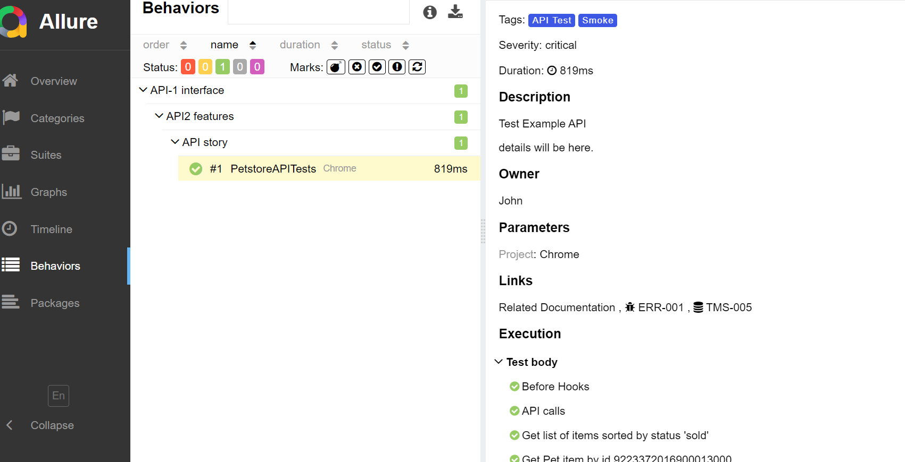

### install dependencies

```sh
npm install
npx playwright install
```

### generate api client for TypeScript 

```sh
npm install @openapitools/openapi-generator-cli -D
npx openapi-generator-cli generate -g typescript-axios -i https://petstore.swagger.io/v2/swagger.json -o ./src/api
```

note: there are variety of options:
    - typescript (experimental)
    - typescript-angular
    - typescript-aurelia
    - typescript-axios
    - typescript-fetch
    - typescript-inversify
    - typescript-jquery
    - typescript-nestjs (experimental)
    - typescript-node
    - typescript-redux-query
    - typescript-rxjs

for more details see "openapi-generator-cli list"


### run api test

```sh
npx playwright test --grep "@TC001" --project=Chrome
```


### to open last HTML report run:

```sh
npx playwright show-report html-report
```

### allure report run:

```sh
npm install -g allure-commandline --save-dev
allure serve
```

more about allure https://allurereport.org/docs/playwright/

Example of using:
```sh
npx playwright test --grep "@TC001" --project=Chrome
{"level":"info","message":"Test Case Started : PetstoreAPITests"}
{"level":"info","message":"Executing Step : API calls"}
{"level":"info","message":"Executing Step : Get list of items sorted by status 'sold'"}
{"level":"info","message":"Executing Step : Get Pet item by id 9223372016900013000"}
{"level":"info","message":"Test Case Completed : PetstoreAPITests Status : passed"}
```
allure report

